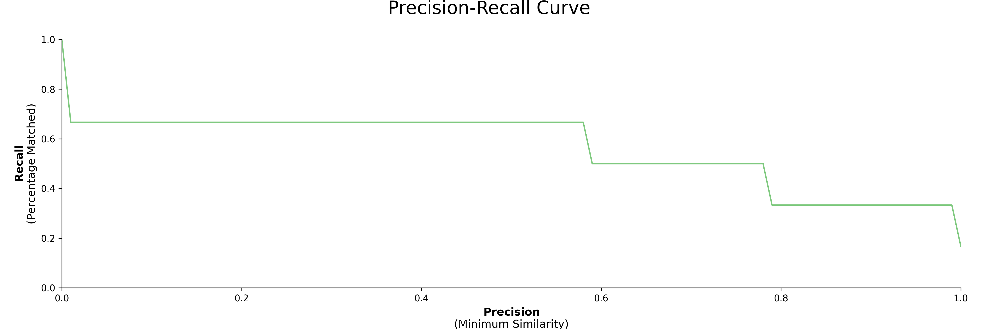
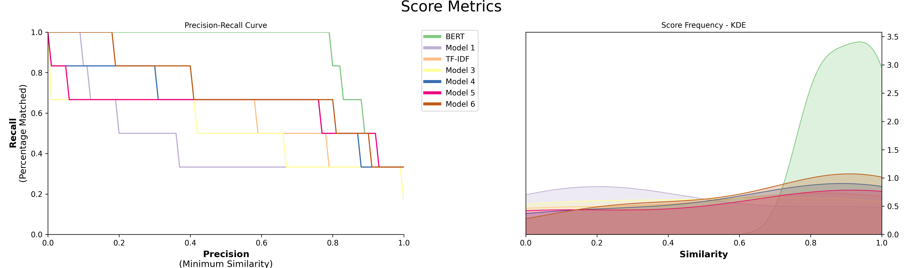

[](https://pypi.org/project/keybert/)
[](https://github.com/MaartenGr/keybert/blob/master/LICENSE)
[](https://pypi.org/project/polyfuzz/)
[](https://pypi.org/project/polyfuzz/)
[](https://maartengr.github.io/PolyFuzz/)  
**`PolyFuzz`** performs fuzzy string matching, string grouping, and contains extensive evaluation functions. 
PolyFuzz is meant to bring fuzzy string matching techniques together within a single framework.

Currently, methods include a variety of edit distance measures, a character-based n-gram TF-IDF, word embedding
techniques such as FastText and GloVe, and 🤗 transformers embeddings.  

Corresponding medium post can be found [here](https://towardsdatascience.com/string-matching-with-bert-tf-idf-and-more-274bb3a95136?source=friends_link&sk=0f765b76ceaba49363829c13dfdc9d98).


<a name="installation"/></a>
## Installation
You can install **`PolyFuzz`** via pip:
 
```bash
pip install polyfuzz
```

You may want to install more depending on the transformers and language backends that you will be using. The possible installations are:

```python
pip install bertopic[sbert]
pip install bertopic[flair]
pip install bertopic[gensim]
pip install bertopic[spacy]
pip install bertopic[use]
```

If you want to speed up the cosine similarity comparison and decrease memory usage when using embedding models, 
you can use `sparse_dot_topn` which is installed via:

```bash
pip install polyfuzz[fast]
```

<details>
<summary>Installation Issues</summary>

You might run into installation issues with `sparse_dot_topn`. If so, one solution that has worked for many 
is by installing it via conda first before installing PolyFuzz:

```bash
conda install -c conda-forge sparse_dot_topn
```

If that does not work, I would advise you to look through their 
issues](https://github.com/ing-bank/sparse_dot_topn/issues) page or continue to use PolyFuzz without `sparse_dot_topn`. 

</details>  


<a name="gettingstarted"/></a>
## Getting Started

For an in-depth overview of the possibilities of `PolyFuzz` 
you can check the full documentation [here](https://maartengr.github.io/PolyFuzz/) or you can follow along 
with the notebook [here](https://github.com/MaartenGr/PolyFuzz/blob/master/notebooks/Overview.ipynb).

### Quick Start

The main goal of `PolyFuzz` is to allow the user to perform different methods for matching strings. 
We start by defining two lists, one to map from and one to map to. We are going to be using `TF-IDF` to create 
n-grams on a character level in order to compare similarity between strings. Then, we calculate the similarity 
between strings by calculating the cosine similarity between vector representations. 

We only have to instantiate `PolyFuzz` with `TF-IDF` and match the lists:

```python
from polyfuzz import PolyFuzz

from_list = ["apple", "apples", "appl", "recal", "house", "similarity"]
to_list = ["apple", "apples", "mouse"]

model = PolyFuzz("TF-IDF")
model.match(from_list, to_list)
```  

The resulting matches can be accessed through `model.get_matches()`:

```python
>>> model.get_matches()
         From      To    Similarity
0       apple   apple    1.000000
1      apples  apples    1.000000
2        appl   apple    0.783751
3       recal    None    0.000000
4       house   mouse    0.587927
5  similarity    None    0.000000

``` 

**NOTE 1**: If you want to compare distances within a single list, you can simply pass that list as such: `model.match(from_list)`

**NOTE 2**: When instantiating `PolyFuzz` we also could have used "EditDistance" or "Embeddings" to quickly 
access Levenshtein and FastText (English) respectively. 

### Group Matches
We can group the matches `To` as there might be significant overlap in strings in our to_list. 
To do this, we calculate the similarity within strings in to_list and use `single linkage` to then 
group the strings with a high similarity.

When we extract the new matches, we can see an additional column `Group` in which all the `To` matches were grouped to:

```python
>>> model.group(link_min_similarity=0.75)
>>> model.get_matches()
	      From	To		Similarity	Group
0	     apple	apple	1.000000	apples
1	    apples	apples	1.000000	apples
2	      appl	apple	0.783751	apples
3	     recal	None	0.000000	None
4	     house	mouse	0.587927	mouse
5	similarity	None	0.000000	None
```

As can be seen above, we grouped apple and apples together to `apple` such that when a string is mapped to `apple` it 
will fall in the cluster of `[apples, apple]` and will be mapped to the first instance in the cluster which is `apples`.

### Precision-Recall Curve  
Next, we would like to see how well our model is doing on our data. We express our results as 
**`precision`** and **`recall`** where precision is defined as the minimum similarity score before a match is correct and 
recall the percentage of matches found at a certain minimum similarity score.  

Creating the visualizations is as simple as:

```
model.visualize_precision_recall()
```
 

## Models
Currently, the following models are implemented in PolyFuzz:
* TF-IDF
* EditDistance (you can use any distance measure, see [documentation](https://maartengr.github.io/PolyFuzz/tutorial/models/#EditDistance))
* FastText and GloVe
* 🤗 Transformers

With `Flair`, we can use all 🤗 Transformers [models](https://huggingface.co/transformers/pretrained_models.html). 
We simply have to instantiate any Flair WordEmbedding method and pass it through PolyFuzzy.

All models listed above can be found in `polyfuzz.models` and can be used to create and compare different models:

```python
from polyfuzz.models import EditDistance, TFIDF, Embeddings
from flair.embeddings import TransformerWordEmbeddings

embeddings = TransformerWordEmbeddings('bert-base-multilingual-cased')
bert = Embeddings(embeddings, min_similarity=0, model_id="BERT")
tfidf = TFIDF(min_similarity=0)
edit = EditDistance()

string_models = [bert, tfidf, edit]
model = PolyFuzz(string_models)
model.match(from_list, to_list)
```

To access the results, we again can call `get_matches` but since we have multiple models we get back a dictionary 
of dataframes back. 

In order to access the results of a specific model, call `get_matches` with the correct id: 

```python
>>> model.get_matches("BERT")
        From	    To          Similarity
0	apple	    apple	1.000000
1	apples	    apples	1.000000
2	appl	    apple	0.928045
3	recal	    apples	0.825268
4	house	    mouse	0.887524
5	similarity  mouse	0.791548
``` 

Finally, visualize the results to compare the models:

```python
model.visualize_precision_recall(kde=True)
```



## Custom Grouper
We can even use one of the `polyfuzz.models` to be used as the grouper in case you would like to use 
something else than the standard TF-IDF model:

```python
model = PolyFuzz("TF-IDF")
model.match(from_list, to_list)

edit_grouper = EditDistance(n_jobs=1)
model.group(edit_grouper)
```

## Custom Models
Although the options above are a great solution for comparing different models, what if you have developed your own? 
If you follow the structure of PolyFuzz's `BaseMatcher`  
you can quickly implement any model you would like.

Below, we are implementing the ratio similarity measure from RapidFuzz.

```python
import numpy as np
import pandas as pd
from rapidfuzz import fuzz
from polyfuzz.models import BaseMatcher


class MyModel(BaseMatcher):
    def match(self, from_list, to_list):
        # Calculate distances
        matches = [[fuzz.ratio(from_string, to_string) / 100 for to_string in to_list] 
                    for from_string in from_list]
        
        # Get best matches
        mappings = [to_list[index] for index in np.argmax(matches, axis=1)]
        scores = np.max(matches, axis=1)
        
        # Prepare dataframe
        matches = pd.DataFrame({'From': from_list,'To': mappings, 'Similarity': scores})
        return matches
```
Then, we can simply create an instance of MyModel and pass it through PolyFuzz:
```python
custom_model = MyModel()
model = PolyFuzz(custom_model)
```

## Citation
To cite PolyFuzz in your work, please use the following bibtex reference:

```bibtex
@misc{grootendorst2020polyfuzz,
  author       = {Maarten Grootendorst},
  title        = {PolyFuzz: Fuzzy string matching, grouping, and evaluation.},
  year         = 2020,
  publisher    = {Zenodo},
  version      = {v0.2.2},
  doi          = {10.5281/zenodo.4461050},
  url          = {https://doi.org/10.5281/zenodo.4461050}
}
```

## References
Below, you can find several resources that were used for or inspired by when developing PolyFuzz:  
  
**Edit distance algorithms**:  
These algorithms focus primarily on edit distance measures and can be used in `polyfuzz.models.EditDistance`:

* https://github.com/jamesturk/jellyfish
* https://github.com/ztane/python-Levenshtein
* https://github.com/seatgeek/fuzzywuzzy
* https://github.com/maxbachmann/rapidfuzz
* https://github.com/roy-ht/editdistance

**Other interesting repos**:

* https://github.com/ing-bank/sparse_dot_topn
    * Used in PolyFuzz for fast cosine similarity between sparse matrices
