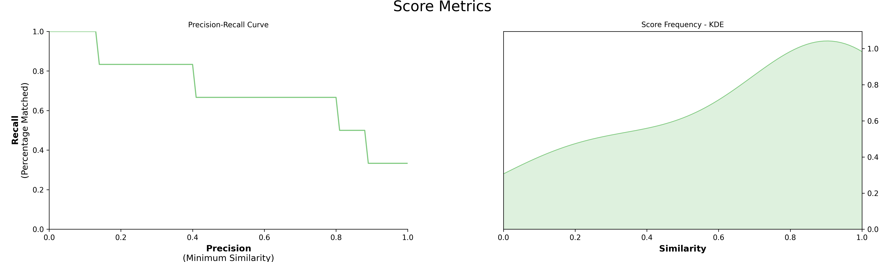

# Custom Models

Although PolyFuzz has several models implemented, what if you have developed your own? 
What if you want a different similarity/distance measure that is not defined in PolyFuzz? 
That is where custom models come in. If you follow the structure of PolyFuzz's `BaseMatcher` you can 
quickly implement any model you would like.

You simply create a class using `BaseMatcher`, make sure it has a function `match` that inputs
two lists and outputs a pandas dataframe. That's it! 

We start by creating our own model that implements the ratio similarity measure from RapidFuzz:
```python
import numpy as np
import pandas as pd
from rapidfuzz import fuzz

from polyfuzz import PolyFuzz
from polyfuzz.models import BaseMatcher


class MyModel(BaseMatcher):
    def match(self, from_list, to_list):
        # Calculate distances
        matches = [[fuzz.ratio(from_string, to_string) / 100 
                   for to_string in to_list] for from_string in from_list]
        
        # Get best matches
        mappings = [to_list[index] for index in np.argmax(matches, axis=1)]
        scores = np.max(matches, axis=1)
        
        # Prepare dataframe
        matches = pd.DataFrame({'From': from_list,
                                'To': mappings, 
                                'Similarity': scores})
        return matches
``` 

`MyModel` can now be used within `PolyFuzz` and runs like every other model:

```python
from_list = ["apple", "apples", "appl", "recal", "house", "similarity"]
to_list = ["apple", "apples", "mouse"]

custom_matcher = MyModel()

model = PolyFuzz(custom_matcher).match(from_list, to_list)
```

Now we can visualize the results:

```python
model.visualize_precision_recall(kde=True)
``` 


