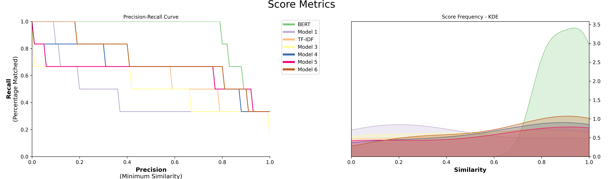

# Models
Currently, the following models are implemented in PolyFuzz:  
1. TF-IDF  
2. EditDistance with RapidFuzz  
3. FastText and GloVe  
4. 🤗 Transformers  
5. SentenceTransformers  
6. Gensim
7. Spacy

With `Flair`, we can use all 🤗 Transformers that are 
[publicly available](https://huggingface.co/transformers/pretrained_models.html). 
We simply have to instantiate any Flair WordEmbedding method and pass it through PolyFuzz.

All models listed above can be found in `polyfuzz.models` and can be used to create and compare different matchers.

## TF-IDF
Although the terms in TF-IDF are usually words, we are going to be using TF-IDF on a character-level.
We will be extracting n-grams from a string and count the frequency of these n-grams across all input strings. 
For example, with 3-grams, the word "hotel" can be defined as "hot", "ote", and "tel". 

After generating the n-grams and applying TF-IDF on these "terms", we can use cosine similarity to compare 
the generated TF-IDF vectors against each other. 

We simply load in `TFIDF` from `polyfuzz.models` and pass it to our `PolyFuzz` instance:

```python
from polyfuzz.models import TFIDF
from polyfuzz import PolyFuzz

from_list = ["apple", "apples", "appl", "recal", "house", "similarity"]
to_list = ["apple", "apples", "mouse"]

tfidf = TFIDF(n_gram_range=(3, 3), min_similarity=0, model_id="TF-IDF")
model = PolyFuzz(tfidf).match(from_list, to_list)
``` 

and that's it! You can play around with the `TFIDF` matcher until you get the results you are looking for. 
Note that if you increase the `min_similarity` there is a chance that some strings will not be matched at all. 

## EditDistance
There are many edit distance functions one could use and the `EditDistance` model from `polyfuzz.models` allows 
you to pass in any distance function. As long as that distance function takes in two strings and spits out a float, 
you can pass anything!

In the example below, we are going to be using Jaro Winkler Similarity from the jellyfish package to create our 
custom scorer:

```python
from polyfuzz import PolyFuzz
from polyfuzz.models import EditDistance
from jellyfish import jaro_winkler_similarity

from_list = ["apple", "apples", "appl", "recal", "house", "similarity"]
to_list = ["apple", "apples", "mouse"]

jellyfish_matcher = EditDistance(n_jobs=1, scorer=jaro_winkler_similarity)
model = PolyFuzz(jellyfish_matcher).match(from_list, to_list)
```

## RapidFuzz
Edit distance measures are typically quite slow. Moreover, the one that is heavily used, `fuzzywuzzy`, has a very 
restrictive licence (GPL). Instead, I decided to create a `RapidFuzz` matcher which is a 
[fast implementation](https://github.com/maxbachmann/rapidfuzz) of fuzzywuzzy and has a less restrictive licence (MIT): 

 
```python
from polyfuzz import PolyFuzz
from polyfuzz.models import RapidFuzz

from_list = ["apple", "apples", "appl", "recal", "house", "similarity"]
to_list = ["apple", "apples", "mouse"]

rapidfuzz_matcher = RapidFuzz(n_jobs=1)
model = PolyFuzz(rapidfuzz_matcher).match(from_list, to_list)
```

## Embeddings
With `Flair`, we can use all 🤗 Transformers that are 
[publicly available](https://huggingface.co/transformers/pretrained_models.html). 
The embeddings that are created are compared with cosine similarity in order to understand how similar the created 
embeddings are to each other.

We simply have to instantiate any Flair WordEmbedding method and pass it through PolyFuzz: 

```python
from polyfuzz import PolyFuzz
from polyfuzz.models import Embeddings
from flair.embeddings import TransformerWordEmbeddings

from_list = ["apple", "apples", "appl", "recal", "house", "similarity"]
to_list = ["apple", "apples", "mouse"]

bert = TransformerWordEmbeddings('bert-base-multilingual-cased')
bert_matcher = Embeddings(bert, min_similarity=0)

models = PolyFuzz(bert_matcher).match(from_list, to_list)
```

`Flair` allows you to use pool word embeddings to create more powerful word embeddings. 
Below, we pool FastText and BERT to create a single embedding representation from which we can 
calculate the similarity between strings:

```python
from polyfuzz import PolyFuzz
from polyfuzz.models import Embeddings
from flair.embeddings import TransformerWordEmbeddings, WordEmbeddings

from_list = ["apple", "apples", "appl", "recal", "house", "similarity"]
to_list = ["apple", "apples", "mouse"]

bert = TransformerWordEmbeddings('bert-base-multilingual-cased')
bert_matcher = Embeddings(bert, min_similarity=0)

fasttext = WordEmbeddings('en-crawl')
fasttext_matcher = Embeddings(fasttext, min_similarity=0) 

matchers = [bert_matcher, fasttext_matcher]

models = PolyFuzz(matchers).match(from_list, to_list)
```

## SentenceTransformers
We can use `sentence-transformers` to generate embeddings from our input list and find the closest matching 
entities using cosine similarity. We simply have to instantiate our `SentenceEmbeddings` class and pass it to PolyFuzz:


```python
from polyfuzz import PolyFuzz
from polyfuzz.models import SentenceEmbeddings

from_list = ["apple", "apples", "appl", "recal", "house", "similarity"]
to_list = ["apple", "apples", "mouse"]

distance_model = SentenceEmbeddings("all-MiniLM-L6-v2")
model = PolyFuzz(distance_model).match(from_list, to_list)
```

For a full list of possible models, click [this](https://www.sbert.net/docs/pretrained_models.html) link. 

You can also use a custom SentenceTransformer model:

```python
from polyfuzz import PolyFuzz
from polyfuzz.models import SentenceEmbeddings
from sentence_transformers import SentenceTransformer

from_list = ["apple", "apples", "appl", "recal", "house", "similarity"]
to_list = ["apple", "apples", "mouse"]

embedding_model = SentenceTransformer("all-MiniLM-L6-v2")
distance_model = SentenceEmbeddings(embedding_model)
model = PolyFuzz(distance_model).match(from_list, to_list)
```

## Gensim
We can use `gensim` to load in a word embedding model to generate embeddings from our input list and find the closest matching 
entities using cosine similarity. We simply have to instantiate our `GensimEmbeddings` class and pass it to PolyFuzz:


```python
from polyfuzz import PolyFuzz
from polyfuzz.models import GensimEmbeddings

from_list = ["apple", "apples", "appl", "recal", "house", "similarity"]
to_list = ["apple", "apples", "mouse"]

distance_model = GensimEmbeddings("glove-twitter-25")
model = PolyFuzz(distance_model).match(from_list, to_list)
```

For a full list of possible models, click [this](https://github.com/RaRe-Technologies/gensim-data#models) link. 

You can also use a custom Gensim model:

```python
from polyfuzz import PolyFuzz
from polyfuzz.models import GensimEmbeddings
import gensim.downloader as api

from_list = ["apple", "apples", "appl", "recal", "house", "similarity"]
to_list = ["apple", "apples", "mouse"]

embedding_model = api.load("glove-twitter-25")
distance_model = GensimEmbeddings(embedding_model)
model = PolyFuzz(distance_model).match(from_list, to_list)
```

## Spacy
We can use `spacy` to load in an embedding model to generate embeddings from our input list and find the closest matching 
entities using cosine similarity. We simply have to instantiate our `SpacyEmbeddings` class and pass it to PolyFuzz:


```python
from polyfuzz import PolyFuzz
from polyfuzz.models import SpacyEmbeddings

from_list = ["apple", "apples", "appl", "recal", "house", "similarity"]
to_list = ["apple", "apples", "mouse"]

distance_model = SpacyEmbeddings("en_core_web_md")
model = PolyFuzz(distance_model).match(from_list, to_list)
```

For a full list of possible models, click [this](https://spacy.io/usage/models) link. 

You can also use a custom Spacy model:

```python
from polyfuzz import PolyFuzz
from polyfuzz.models import SpacyEmbeddings
import spacy


from_list = ["apple", "apples", "appl", "recal", "house", "similarity"]
to_list = ["apple", "apples", "mouse"]

embedding_model = spacy.load("en_core_web_md", exclude=['tagger', 'parser', 'ner', 'attribute_ruler', 'lemmatizer'])
distance_model = SpacyEmbeddings(embedding_model)
model = PolyFuzz(distance_model).match(from_list, to_list)
```

## Universal Sentence Encoder (USE)

The Universal Sentence Encoder encodes text into high-dimensional vectors that are used here for embedding the strings. 
The model is trained and optimized for greater-than-word length text, such as sentences, phrases, or short paragraphs.

We simply have to instantiate our `USEEmbeddings` class and pass it to PolyFuzz:


```python
from polyfuzz import PolyFuzz
from polyfuzz.models import USEEmbeddings

from_list = ["apple", "apples", "appl", "recal", "house", "similarity"]
to_list = ["apple", "apples", "mouse"]

distance_model = USEEmbeddings("https://tfhub.dev/google/universal-sentence-encoder/4")
model = PolyFuzz(distance_model).match(from_list, to_list)
```

For a full list of possible models, click [this](https://spacy.io/usage/models) link. 

You can also use a custom USE model:

```python
from polyfuzz import PolyFuzz
from polyfuzz.models import USEEmbeddings
import tensorflow_hub

from_list = ["apple", "apples", "appl", "recal", "house", "similarity"]
to_list = ["apple", "apples", "mouse"]

embedding_model = tensorflow_hub.load("https://tfhub.dev/google/universal-sentence-encoder/4")
distance_model = USEEmbeddings(embedding_model)
model = PolyFuzz(distance_model).match(from_list, to_list)
```


## Using Multiple Models
```python
from polyfuzz import PolyFuzz
from polyfuzz.models import EditDistance, TFIDF, Embeddings
from flair.embeddings import TransformerWordEmbeddings

from_list = ["apple", "apples", "appl", "recal", "house", "similarity"]
to_list = ["apple", "apples", "mouse"]

bert = TransformerWordEmbeddings('bert-base-multilingual-cased')
bert_matcher = Embeddings(bert, min_similarity=0, model_id="BERT")
tfidf_matcher = TFIDF(min_similarity=0)
edit_matcher = EditDistance()

matchers = [bert_matcher, tfidf_matcher, edit_matcher]
models = PolyFuzz(matchers).match(from_list, to_list)
```

To access the results, we again can call `get_matches` but since we have multiple models we get back a dictionary 
of dataframes back. 

In order to access the results of a specific model, call `get_matches` with the correct id: 

```python
>>> models.get_matches("BERT")
        From	    To          Similarity
0	apple	    apple	1.000000
1	apples	    apples	1.000000
2	appl	    apple	0.928045
3	recal	    apples	0.825268
4	house	    mouse	0.887524
5	similarity  mouse	0.791548
``` 

Finally, visualize the results to compare the models:

```python
models.visualize_precision_recall(kde=True)
```

