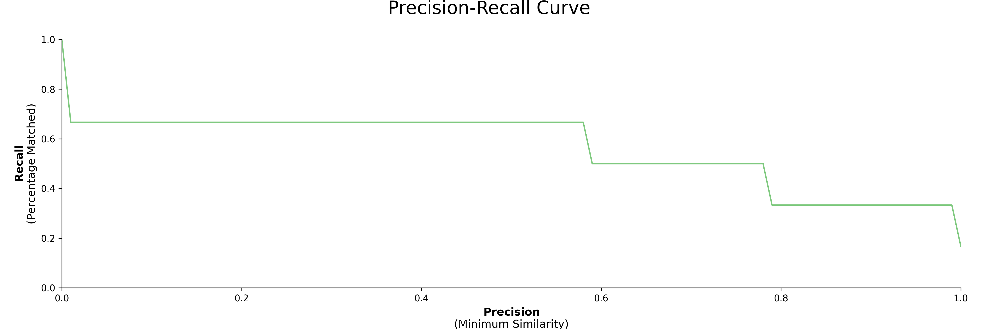

## Installation
You can install **`PolyFuzz`** via pip:
 
```bash
pip install polyfuzz
```

You may want to install more depending on the transformers and language backends that you will be using. The possible installations are:

```python
pip install bertopic[sbert]
pip install bertopic[flair]
pip install bertopic[gensim]
pip install bertopic[spacy]
pip install bertopic[use]
```

If you want to speed up the cosine similarity comparison and decrease memory usage when using embedding models, 
you can use `sparse_dot_topn` which is installed via:

```bash
pip install polyfuzz[fast]
```

## Getting Started

The main goal of `PolyFuzz` is to allow the user to perform different methods for matching strings. 
We start by defining two lists, one to map from and one to map to. We are going to be using `TF-IDF` to create 
n-grams on a character level in order to compare similarity between strings. 

We only have to instantiate `PolyFuzz` with `TF-IDF` and match the lists:

```python
from polyfuzz import PolyFuzz

from_list = ["apple", "apples", "appl", "recal", "house", "similarity"]
to_list = ["apple", "apples", "mouse"]

model = PolyFuzz("TF-IDF").match(from_list, to_list)
```  

The resulting matches can be accessed through `model.get_matches()`:

```python
>>> model.get_matches()
         From      To    Similarity
0       apple   apple    1.000000
1      apples  apples    1.000000
2        appl   apple    0.783751
3       recal    None    0.000000
4       house   mouse    0.587927
5  similarity    None    0.000000

``` 

**NOTE**: When instantiating `PolyFuzz` we also could have used "EditDistance" or "Embeddings" to quickly 
access Levenshtein and FastText (English) respectively. 

### Group Matches
We can group the matches `To` as there might be significant overlap in strings in our to_list. 
To do this, we calculate the similarity within strings in to_list and use `single linkage` to then 
group the strings with a high similarity.

When we extract the new matches, we can see an additional column `Group` in which all the `To` matches were grouped to:

```python
>>> model.group(link_min_similarity=0.75)
>>> model.get_matches()
	      From	To		Similarity	Group
0	     apple	apple	1.000000	apples
1	    apples	apples	1.000000	apples
2	      appl	apple	0.783751	apples
3	     recal	None	0.000000	None
4	     house	mouse	0.587927	mouse
5	similarity	None	0.000000	None
```

As can be seen above, we grouped apple and apples together to `apple` such that when a string is mapped to `apple` it 
will fall in the cluster of `[apples, apple]` and will be mapped to the first instance in the cluster which is `apples`.

### Precision-Recall Curve  
Next, we would like to see how well our model is doing on our data. We express our results as 
**`precision`** and **`recall`** where precision is defined as the minimum similarity score before a match is correct and 
recall the percentage of matches found at a certain minimum similarity score.  

Creating the visualizations is as simple as:

```
model.visualize_precision_recall()
```


 